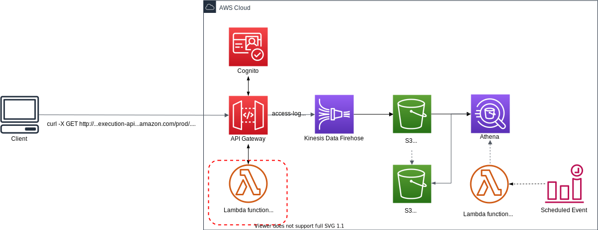

# SaaS Metering system on AWS demo project!

This SaaS Metering system allows Software-as-a-Service (SaaS) providers to accurately meter and bill their customers based on precise **API usage**. This fully-managed service streamlines tracking and monetizing SaaS offerings by enabling **usage-based billing models**.

Below diagram shows what we are implementing.

| Example | Architecture Diagram | Tags |
|---------|----------------------|------|
| [SaaS Metering system using Parquet](./v1) |  | Amazon API Gateway, Amazon Data Firehose, Amazon S3 + Parquet, Amazon Athena, AWS Lambda, Amazon Event Bridge |
| [SaaS Metering system using Apache Iceberg table](./v2) |  | Amazon API Gateway, Amazon Data Firehose, Amazon S3 + Apache Iceberg, Amazon Athena, AWS Lambda |

## Security

See [CONTRIBUTING](CONTRIBUTING.md#security-issue-notifications) for more information.

## License

This library is licensed under the MIT-0 License. See the LICENSE file.

