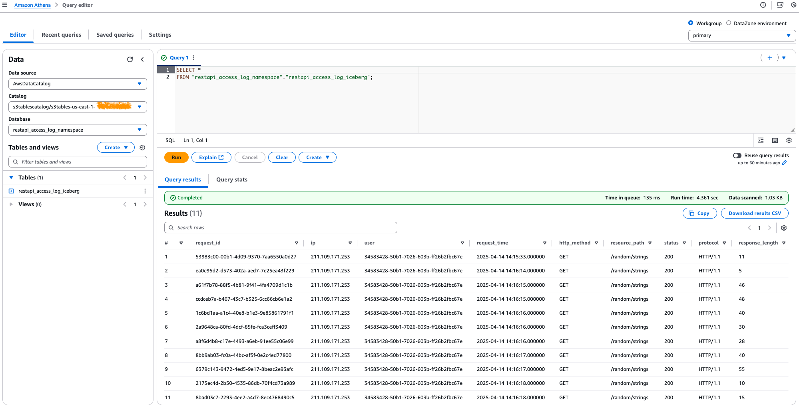

# SaaS Metering system on AWS demo project!

This SaaS Metering system allows Software-as-a-Service (SaaS) providers to accurately meter and bill their customers based on precise **API usage**. This fully-managed service streamlines tracking and monetizing SaaS offerings by enabling **usage-based billing models**.

**Key features**:

1. **Usage-Based Billing**: Bill customers only for what they use based on API calls, data transfers, or custom metrics aligned with your business model.
2. **Seamless Integration**: Integrate with existing AWS infrastructure to instrument applications and capture real-time usage data.
3. **Automated Billing**: Automate billing and invoicing processes, reducing overhead.
4. **Scalability and Reliability**: Highly scalable and reliable service to support SaaS business growth.
5. **Flexible Pricing Models**: Easily extensible to support pay-per-use, tiered pricing, and custom pricing rules.

This SaaS Metering system can unlock new revenue streams, improve customer satisfaction, and provide a competitive edge in the SaaS market through accurate usage-based billing. Getting started is straightforward with this solution. SaaS providers can now streamline billing processes, optimize pricing strategies, and drive business growth with this new AWS service.

This repository provides you cdk scripts and sample codes on how to implement a simple SaaS metering system.

Below diagram shows what we are implementing.


The `cdk.json` file tells the CDK Toolkit how to execute your app.

This project is set up like a standard Python project. The initialization
process also creates a virtualenv within this project, stored under the `.venv`
directory.  To create the virtualenv it assumes that there is a `python3`
(or `python` for Windows) executable in your path with access to the `venv`
package. If for any reason the automatic creation of the virtualenv fails,
you can create the virtualenv manually.

To manually create a virtualenv on MacOS and Linux:

```
$ python3 -m venv .venv
```

After the init process completes and the virtualenv is created, you can use the following
step to activate your virtualenv.

```
$ source .venv/bin/activate
```

If you are a Windows platform, you would activate the virtualenv like this:

```
% .venv\Scripts\activate.bat
```

Once the virtualenv is activated, you can install the required dependencies.

```
(.venv) $ pip install -r requirements.txt
```

To add additional dependencies, for example other CDK libraries, just add
them to your `setup.py` file and rerun the `pip install -r requirements.txt`
command.

## Prerequisites

Before synthesizing the CloudFormation, you should set approperly the cdk context configuration file, `cdk.context.json`.

In this project, we use the following cdk context:
<pre>
{
  "data_firehose_configuration": {
    "stream_name": "random-gen",
    "buffering_hints": {
      "interval_in_seconds": 60,
      "size_in_mbs": 128
    },
    "transform_records_with_aws_lambda": {
      "buffer_size": 3,
      "buffer_interval": 300,
      "number_of_retries": 3
    },
    "destination_iceberg_table_configuration": {
      "database_name": "restapi_access_log_resource_link",
      "table_name": "restapi_access_log_iceberg"
    },
    "error_output_prefix": "error/year=!{timestamp:yyyy}/month=!{timestamp:MM}/day=!{timestamp:dd}/hour=!{timestamp:HH}/!{firehose:error-output-type}"
  },
  "s3_tables": {
    "namespace_name": "restapi_access_log_namespace",
    "table_name": "restapi_access_log_iceberg"
  }
}
</pre>

## Deploy

At this point you can now synthesize the CloudFormation template for this code.

<pre>
(.venv) $ export CDK_DEFAULT_ACCOUNT=$(aws sts get-caller-identity --query Account --output text)
(.venv) $ export CDK_DEFAULT_REGION=$(aws configure get region)
(.venv) $ cdk synth --all
</pre>

Now let's try to deploy.

#### List all CDK Stacks

```
(.venv) $ cdk list
SaaSMeteringDemoS3TablesTableBucket
SaaSMeteringDemoS3TablesResourceLink
SaaSMeteringDemoS3TablesS3ErrorOutputPath
SaaSMeteringDemoFirehoseToS3TablesRole
SaaSMeteringDemoGrantLFPermissionsOnFirehoseRole
SaaSMeteringDemoRandomGenApiLogToFirehose
SaaSMeteringDemoRandomGenApiGw
```

Use `cdk deploy` command to create the stack shown above.

#### Set up Delivery Stream

1. Create an S3 table bucket and integrate with AWS Analytics services
   <pre>
   (.venv) $ cdk deploy --require-approval never SaaSMeteringDemoS3TablesTableBucket
   </pre>
2. Create a namespace in the table bucket
   <pre>
   S3TABLE_BUCKET_ARN=$(aws cloudformation describe-stacks --stack-name SaaSMeteringDemoS3TablesTableBucket | jq -r '.Stacks[0].Outputs[] | select(.OutputKey == "S3TableBucketArn") | .OutputValue')

   aws s3tables create-namespace \
                --table-bucket-arn ${S3TABLE_BUCKET_ARN} \
                --namespace restapi_access_log_namespace
   </pre>
3. Create a table in the table bucket

   Using AWS CLI, [create a table](https://docs.aws.amazon.com/AmazonS3/latest/userguide/s3-tables-create.html) in the existing namespace in the table bucket as `s3tables_demo_table`. When you create a table, you can also define a schema for the table. For this project, we create a table with a schema consisting of three fields: `id`, `name`, and `value`.
   <pre>
   S3TABLE_BUCKET_ARN=$(aws cloudformation describe-stacks --stack-name SaaSMeteringDemoS3TablesTableBucket | jq -r '.Stacks[0].Outputs[] | select(.OutputKey == "S3TableBucketArn") | .OutputValue')

   aws s3tables create-table --cli-input-json file://mytabledefinition.json
   </pre>
   The following is the sample `mytabledefinition.json` used to set the table schema.
   ```json
   {
     "tableBucketARN": "arn:aws:s3tables:<region>:<account-id>:bucket/<s3tablebucket>",
     "namespace": "restapi_access_log_namespace",
     "name": "restapi_access_log_iceberg",
     "format": "ICEBERG",
     "metadata": {
     "iceberg": {
       "schema": {
        "fields": [
          {"name": "request_id", "type": "string", "required": true},
          {"name": "ip", "type": "string"},
          {"name": "user", "type": "string"},
          {"name": "request_time", "type": "timestamp"},
          {"name": "http_method", "type": "string"},
          {"name": "resource_path", "type": "string"},
          {"name": "status", "type": "string"},
          {"name": "protocol", "type": "string"},
          {"name": "response_length", "type": "int"}
        ]
       }
      }
     }
   }
   ```
   :information_source: For more information, see [here](https://docs.aws.amazon.com/AmazonS3/latest/userguide/s3-tables-create.html).
4. Create a resource link to the namespace
   <pre>
   (.venv) $ cdk deploy --require-approval never SaaSMeteringDemoS3TablesResourceLink
   </pre>
5. Create a lambda function to process the streaming data.
   <pre>
   (.venv) $ cdk deploy --require-approval never SaaSMeteringDemoFirehoseDataTransformLambdaStack
   </pre>
6. Create an IAM role for Data Firehose
   <pre>
   (.venv) $ cdk deploy --require-approval never \
                        SaaSMeteringDemoS3TablesS3ErrorOutputPath \
                        SaaSMeteringDemoFirehoseToS3TablesRole
   </pre>
7. Configure AWS Lake Formation permissions

   AWS Lake Formation manages access to your table resources. For Data Firehose to ingest data into table buckets, the Data Firehose role (created in step 6) requires `DESCRIBE` permissions on the resource link (created in step 4) to discover the S3 Tables namespace through the resource link and **read/write permission** on the underlying table.
   <pre>
   (.venv) $ cdk deploy --require-approval never SaaSMeteringDemoGrantLFPermissionsOnFirehoseRole
   </pre>
8. Set up a Data Firehose stream
   <pre>
   (.venv) $ cdk deploy --require-approval never SaaSMeteringDemoRandomGenApiLogToFirehose
   </pre>

#### Create RESTful APIs endpoint

<pre>
(.venv) $ cdk deploy --require-approval never SaaSMeteringDemoRandomGenApiGw
</pre>

## Run Test

1. Register a Cognito User, using the aws cli
   <pre>
   USER_POOL_CLIENT_ID=$(aws cloudformation describe-stacks --stack-name <i>SaaSMeteringDemoRandomGenApiGw</i> | jq -r '.Stacks[0].Outputs[] | select(.OutputKey == "UserPoolClientId") | .OutputValue')

   aws cognito-idp sign-up \
     --client-id <i>${USER_POOL_CLIENT_ID}</i> \
     --username "<i>user-email-id@domain.com</i>" \
     --password "<i>user-password</i>"
   </pre>
   Note: You can find `UserPoolClientId` with the following command:
   <pre>
   aws cloudformation describe-stacks --stack-name <i>SaaSMeteringDemoRandomGenApiGw</i> | jq -r '.Stacks[0].Outputs[] | select(.OutputKey == "UserPoolClientId") | .OutputValue'
   </pre>
   :information_source: `SaaSMeteringDemoRandomGenApiGw` is the CDK stack name to create a user pool.

2. Confirm the user, so they can log in:
   <pre>
   USER_POOL_ID=$(aws cloudformation describe-stacks --stack-name <i>SaaSMeteringDemoRandomGenApiGw</i> | jq -r '.Stacks[0].Outputs | map(select(.OutputKey == "UserPoolId")) | .[0].OutputValue')

   aws cognito-idp admin-confirm-sign-up \
     --user-pool-id <i>${USER_POOL_ID}</i> \
     --username "<i>user-email-id@domain.com</i>"
   </pre>
   At this point if you look at your cognito user pool, you would see that the user is confirmed and ready to log in:
   

   Note: You can find `UserPoolId` with the following command:
   <pre>
   aws cloudformation describe-stacks --stack-name <i>SaaSMeteringDemoRandomGenApiGw</i> | jq -r '.Stacks[0].Outputs | map(select(.OutputKey == "UserPoolId")) | .[0].OutputValue'
   </pre>

3. Log the user in to get an identity JWT token
   <pre>
   USER_POOL_CLIENT_ID=$(aws cloudformation describe-stacks --stack-name <i>SaaSMeteringDemoRandomGenApiGw</i> | jq -r '.Stacks[0].Outputs[] | select(.OutputKey == "UserPoolClientId") | .OutputValue')

   aws cognito-idp initiate-auth \
     --auth-flow USER_PASSWORD_AUTH \
     --auth-parameters USERNAME="<i>user-email-id@domain.com</i>",PASSWORD="<i>user-password</i>" \
     --client-id <i>${USER_POOL_CLIENT_ID}</i>
   </pre>

4. Invoke REST API method
   <pre>
   $ APIGW_INVOKE_URL=$(aws cloudformation describe-stacks --stack-name <i>SaaSMeteringDemoRandomGenApiGw</i> | jq -r '.Stacks[0].Outputs | map(select(.OutputKey == "RestApiEndpoint")) | .[0].OutputValue')
   $ MY_ID_TOKEN=$(aws cognito-idp initiate-auth --auth-flow USER_PASSWORD_AUTH --auth-parameters USERNAME="<i>user-email-id@domain.com</i>",PASSWORD="<i>user-password</i>" --client-id <i>your-user-pool-client-id</i> | jq -r '.AuthenticationResult.IdToken')
   $ curl -X GET "${APIGW_INVOKE_URL}/random/strings?len=7" --header "Authorization: ${MY_ID_TOKEN}"
   </pre>

   The response is:
   <pre>
   ["weBJDKv"]
   </pre>

5. Generate test requests and run them.
   <pre>
   $ source .venv/bin/activate
   (.venv) $ pip install -U "requests>=2.31.0" "boto3>=1.34.61"
   (.venv) $ python ../tests/run_test.py \
                --apigw-invoke-url 'https://<i>{your-api-gateway-id}</i>.execute-api.<i>{region}</i>.amazonaws.com/prod' \
                --auth-token ${MY_ID_TOKEN} \
                --max-count 10
   </pre>

6. Verify and query data using Athena

   Go to [Athena](https://console.aws.amazon.com/athena/home) on the AWS Management console, after `5~10` minutes.

   Enter the following SQL statement and execute the query.
   <pre>
   SELECT *
   FROM "restapi_access_log_namespace"."restapi_access_log_iceberg";
   </pre>
   

## Clean Up

Delete the CloudFormation stack by running the below command.
<pre>
(.venv) $ cdk destroy --force --all
</pre>

## Useful commands

 * `cdk ls`          list all stacks in the app
 * `cdk synth`       emits the synthesized CloudFormation template
 * `cdk deploy`      deploy this stack to your default AWS account/region
 * `cdk diff`        compare deployed stack with current state
 * `cdk docs`        open CDK documentation

Enjoy!

## References

 * [Amazon API Gateway - Logging API calls to Kinesis Data Firehose](https://docs.aws.amazon.com/apigateway/latest/developerguide/apigateway-logging-to-kinesis.html)
 * [Setting up CloudWatch logging for a REST API in API Gateway](https://docs.aws.amazon.com/apigateway/latest/developerguide/set-up-logging.html)
 * [Amazon API Gateway - $context Variables for data models, authorizers, mapping templates, and CloudWatch access logging](https://docs.aws.amazon.com/apigateway/latest/developerguide/api-gateway-mapping-template-reference.html#context-variable-reference)
 * [Amazon AIP Gateway - Integrate a REST API with an Amazon Cognito user pool](https://docs.aws.amazon.com/apigateway/latest/developerguide/apigateway-enable-cognito-user-pool.html)
 * [Building fine-grained authorization using Amazon Cognito, API Gateway, and IAM (2021-05-21)](https://aws.amazon.com/ko/blogs/security/building-fine-grained-authorization-using-amazon-cognito-api-gateway-and-iam/)
 * [How to resolve "Invalid permissions on Lambda function" errors from API Gateway REST APIs](https://aws.amazon.com/premiumsupport/knowledge-center/api-gateway-rest-api-lambda-integrations/)
 * [AWS Lake Formation - Create a data lake administrator](https://docs.aws.amazon.com/lake-formation/latest/dg/getting-started-setup.html#create-data-lake-admin)
 * [AWS Lake Formation Permissions Reference](https://docs.aws.amazon.com/lake-formation/latest/dg/lf-permissions-reference.html)
 * [Tutorial: Schedule AWS Lambda Functions Using CloudWatch Events](https://docs.aws.amazon.com/AmazonCloudWatch/latest/events/RunLambdaSchedule.html)
 * [Amazon Athena Workshop](https://athena-in-action.workshop.aws/)
 * [Curl Cookbook](https://catonmat.net/cookbooks/curl)

## Security

See [CONTRIBUTING](CONTRIBUTING.md#security-issue-notifications) for more information.

## License

This library is licensed under the MIT-0 License. See the LICENSE file.

